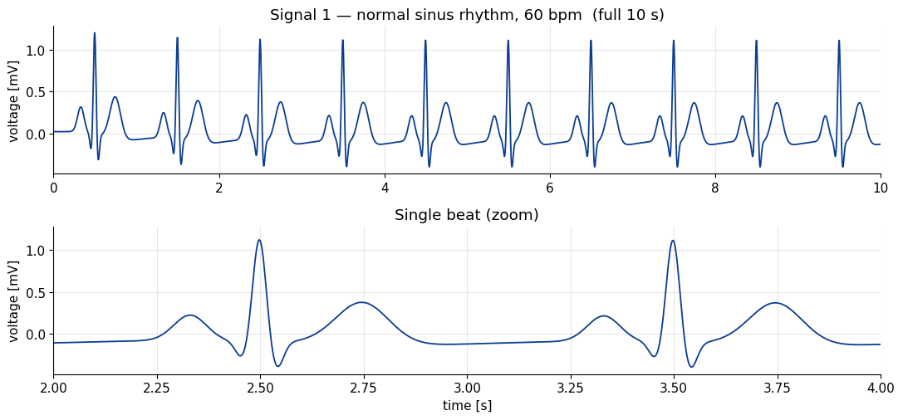
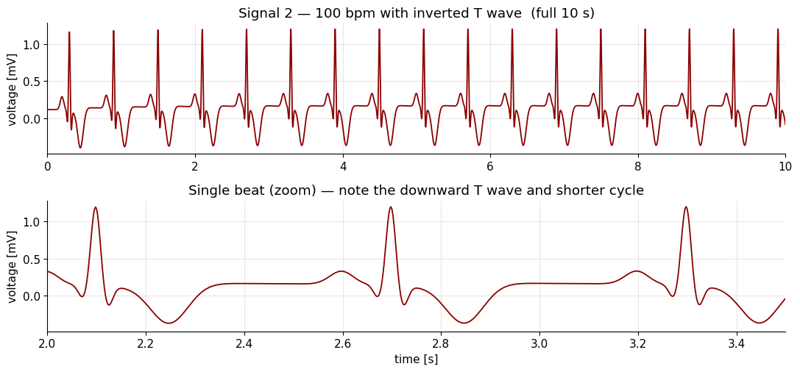
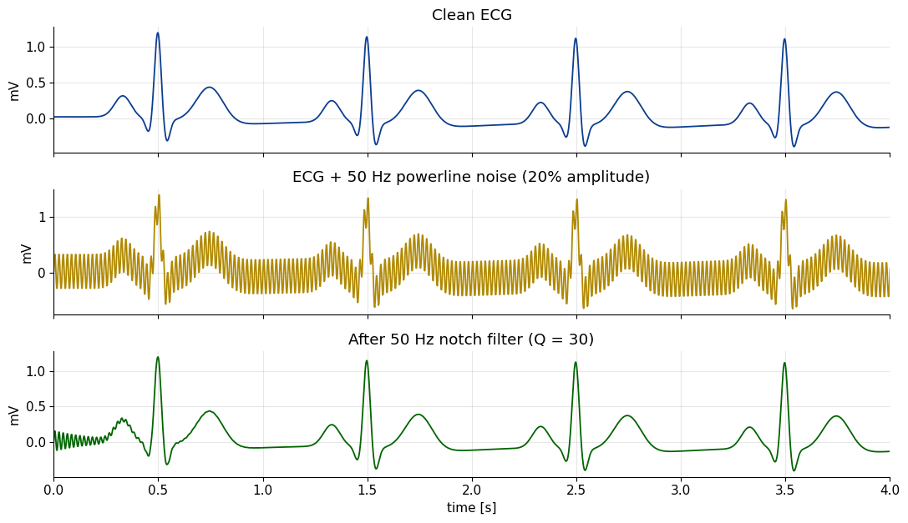
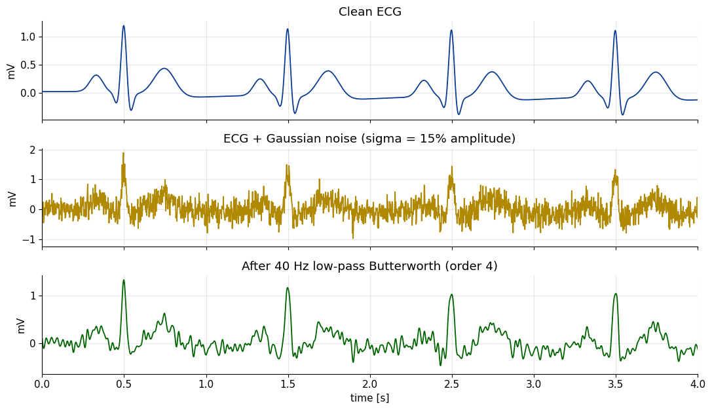
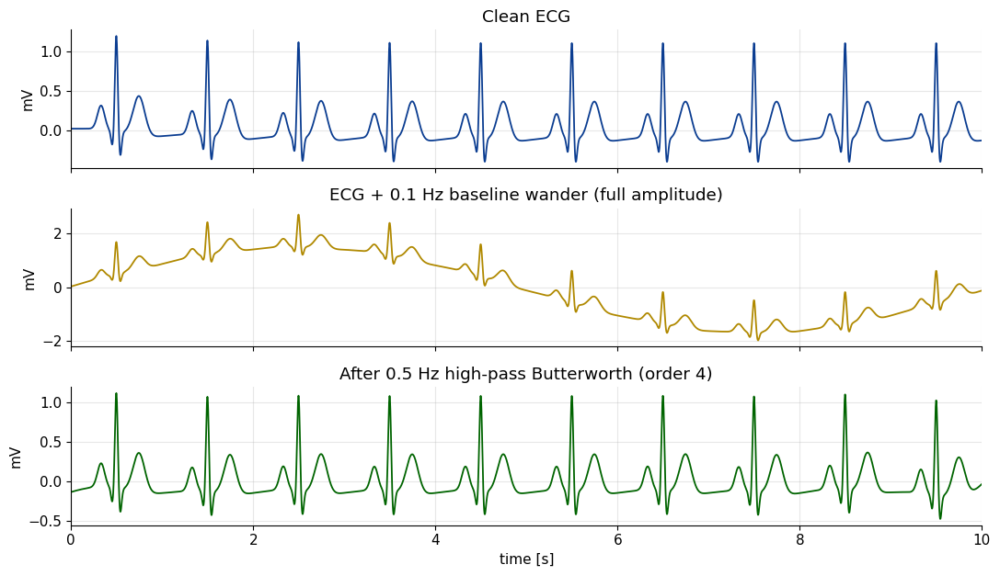
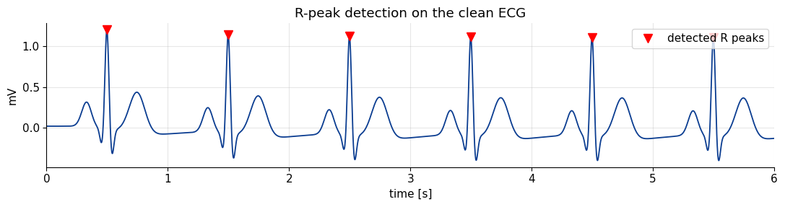
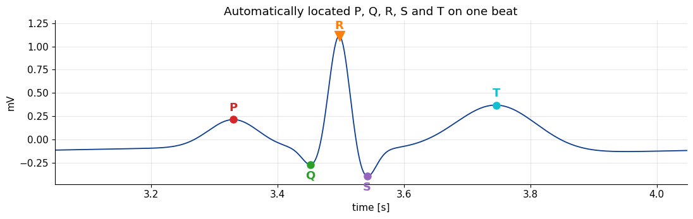

# ECG From Scratch

A synthetic electrocardiogram grown from three differential equations, then put
to work: corrupted with the three artefacts a real recording actually suffers,
cleaned with a filter matched to each, and finally measured — heart rate and
every P, Q, R, S and T landmark recovered from the trace.

The point is the round trip. The signal is generated with known properties, and
standard signal processing has to give those properties back.

---

## The McSharry model

The clever part of McSharry *et al.* (2003) is that it never writes down a
formula for the ECG waveform. It builds a small dynamical system whose *natural
motion* traces out a PQRST complex.

Two of the three states are just a clock:

```
ẋ = αx − ωy,    ẏ = αy + ωx,    α = 1 − √(x² + y²)
```

That `α` term is what makes the unit circle attracting — drift inside or outside
and it pushes you straight back — so the trajectory settles onto a limit cycle.
One lap is one heartbeat, and the angle `θ = atan2(y, x)` says where you are in
the cardiac cycle.

The ECG voltage is the third state. Left alone `z` relaxes to a baseline, but at
five fixed angles — one each for P, Q, R, S, T — sits an event that kicks it:

```
ż = −Σᵢ aᵢ·Δθᵢ·exp(−Δθᵢ²/2bᵢ²) − (z − z₀),    Δθᵢ = (θ − θᵢ) mod 2π
```

Each event is shaped like the derivative of a Gaussian, so the trajectory gets
pushed one way going in and back the other way coming out, carving a localised
bump or dip. `aᵢ` sets strength and sign, `bᵢ` sets width. Five events, and the
familiar waveform falls out.

Integration is fixed-step **fourth-order Runge–Kutta** at `dt = 1/fs`, exactly
as the paper does, with the raw dimensionless output linearly rescaled to a
physiological −0.4 to 1.2 mV as the authors' own `ecgsyn` reference
implementation does. Morphology parameters are Table I of the paper, unmodified.

---

## Two hearts

**Normal sinus rhythm, 60 bpm** — default morphology.



**Tachycardia at 100 bpm with an inverted T wave** — produced by raising `ω`
and flipping the sign of the T event's amplitude (`a_T` from +0.75 to −0.9),
plus a smaller P. That a clinically meaningful abnormality is *one sign change*
in a five-element vector is the best argument for the model: pathology becomes a
coordinate in parameter space, not a redrawn template.



---

## Three artefacts, three filters

Signal amplitude is defined as the clean trace's peak-to-peak range, measured at
**1.600 mV**, so every noise level below is unambiguous.

| artefact | filter | RMS error before | after | reduction |
|----------|--------|-----------------:|------:|----------:|
| 50 Hz powerline, 20 % amplitude | IIR notch, Q = 30 | 0.2263 mV | **0.0104 mV** | 22× |
| Gaussian broadband, σ = 15 % | 4th-order Butterworth low-pass, 40 Hz | 0.2399 mV | **0.0929 mV** | 2.6× |
| 0.1 Hz baseline wander, full amplitude | 4th-order Butterworth high-pass, 0.5 Hz | 1.1314 mV | **0.0448 mV** | 25× |







The spread across those three rows is the whole lesson, and it is a
frequency-domain one. Powerline hum is a single sharp line, so a notch a few Hz
wide removes essentially all of it while touching nothing else — 22× down.
Baseline wander sits an order of magnitude *below* the signal band, so a
high-pass separates them almost perfectly despite the noise starting out larger
than the ECG itself — the worst corruption of the three by RMS, and the second
cleanest recovery. Broadband Gaussian noise is the awkward one: it overlaps the
signal everywhere, so any filter that removes it also removes signal. 2.6× is
what a 40 Hz low-pass can honestly buy, and no cleverer choice of cutoff changes
that — the noise inside the passband is simply not separable.

Every filter is applied with `filtfilt` (zero-phase, forward and backward), so
none of the recovered traces carry a group delay that would corrupt the interval
measurements in the next section.

---

## Measuring it back

R peaks are found with a height threshold and a 0.4 s minimum spacing — no
normal heart exceeds ~150 bpm, so peaks cannot be closer. The other four waves
are then located in fixed windows around each R.



```
R peaks detected:        10
Mean RR interval:        1000.0 ms
Estimated heart rate:    60.0 bpm   (set value was 60 bpm)
Beat-to-beat HR spread:  0.00 bpm
```

The recovered rate is exactly the rate dialled in, and the beat-to-beat spread
is exactly zero — which is the correct answer here rather than a suspiciously
good one. This run sets no respiratory sinus arrhythmia, so the model's limit
cycle has a fixed period and every RR interval is identical by construction.
Zero variability is the model telling the truth about itself.



| wave | amplitude |
|------|----------:|
| P | +0.225 mV |
| Q | −0.260 mV |
| R | +1.123 mV |
| S | −0.386 mV |
| T | +0.377 mV |

| interval | value | typical clinical range |
|----------|------:|------------------------|
| PR (P to R) | 168 ms | 120–200 ms |
| QRS width (Q to S) | 90 ms | < 120 ms |
| QT (Q to T) | 294 ms | 350–440 ms at 60 bpm |

The amplitude ordering is right — R dominant, S and Q modest opposing
deflections, P and T small and rounded — and PR and QRS land inside their
normal ranges. QT comes out short of the clinical range, which is a property of
the model rather than a measurement error: the T event's angular position and
width are fixed parameters, so repolarisation timing is whatever `θ_T` and `b_T`
were set to, not something the dynamics derive.

---

## Running it

```bash
pip install -r requirements.txt
jupyter notebook ecg_simulation.ipynb    # or: jupyter lab
```

Needs only NumPy, SciPy and Matplotlib. The RNG is seeded (`default_rng(42)`),
so every number above reproduces exactly. The notebook ships with its outputs,
so it reads as a finished report without being run.

## Layout

| Path | Contents |
|------|----------|
| `ecg_simulation.ipynb` | the whole project — model, noise, filters, features |
| `report.pdf` | the notebook exported as a report, code hidden |
| `figures/` | every figure, extracted from the notebook outputs |

---

## Reference

> P. E. McSharry, G. D. Clifford, L. Tarassenko, L. A. Smith,
> *"A dynamical model for generating synthetic electrocardiogram signals"*,
> IEEE Transactions on Biomedical Engineering, 50(3):289–294, 2003.

```bibtex
@article{mcsharry2003dynamical,
  author  = {McSharry, Patrick E. and Clifford, Gari D. and Tarassenko, Lionel and Smith, Leonard A.},
  title   = {A Dynamical Model for Generating Synthetic Electrocardiogram Signals},
  journal = {IEEE Transactions on Biomedical Engineering},
  volume  = {50},
  number  = {3},
  pages   = {289--294},
  year    = {2003}
}
```

## Background

Built as the second computer assignment for Introduction to Biomedical
Engineering, School of Electrical and Computer Engineering, College of
Engineering, University of Tehran (Spring 1404–1405 / 2026).

## License

MIT — see [LICENSE](LICENSE). The license covers this implementation, not the
paper it reproduces.
